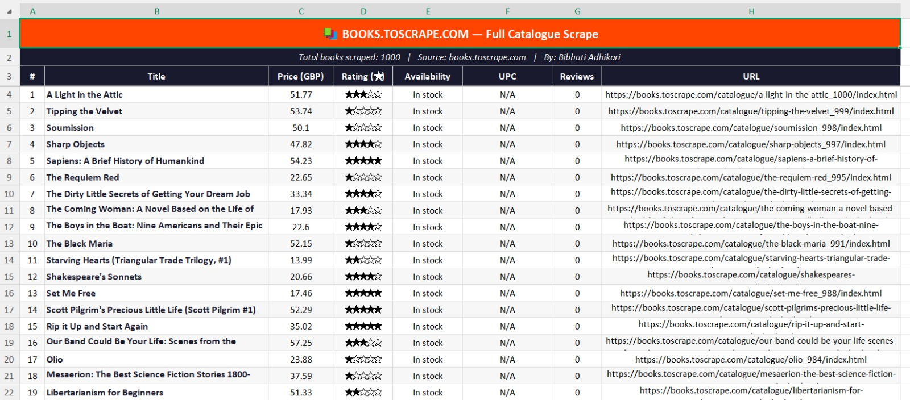

# 📚 Books Scraper — books.toscrape.com

A Python web scraper that extracts all 1000 books from 
books.toscrape.com across 50 pages and exports clean data to Excel.

## 📸 Output Preview

## 🛠️ Technologies Used
- Python 3
- Requests
- BeautifulSoup4
- OpenPyXL
- tqdm

## 📊 Data Collected
- Title
- Price (GBP)
- Star Rating
- Availability
- UPC
- Book URL

## ▶️ How to Run
pip install requests beautifulsoup4 openpyxl tqdm
python Scrapy.py

## 👤 Author
Bibhuti Adhikari — [bibhutiportfolio.vercel.app](https://bibhutiportfolio.vercel.app)

